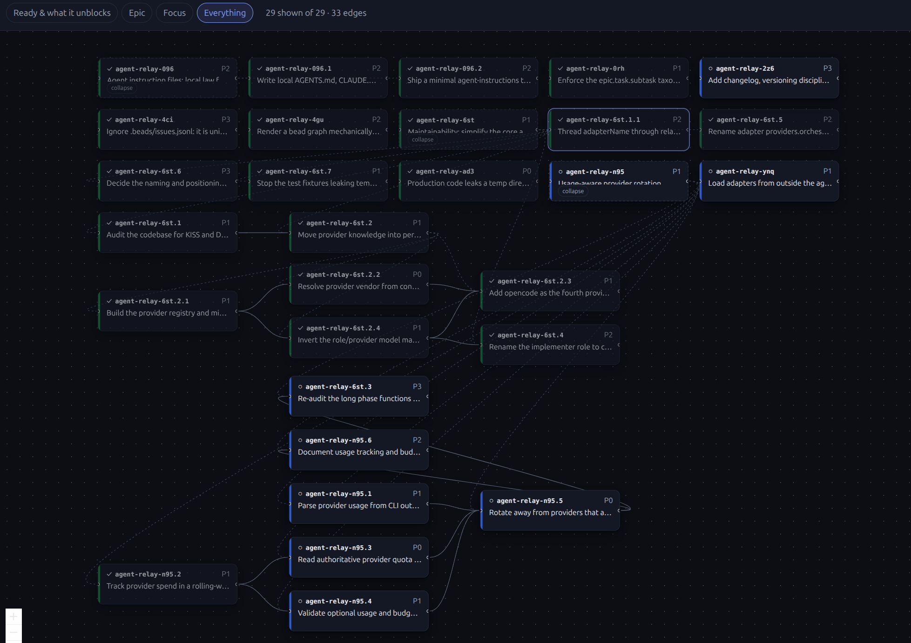

# beads-viewer

An interactive graph editor for [Beads](https://github.com/gastownhall/beads) issues. Run one command in a repository that has a `.beads` store and a browser opens on a dependency graph you can actually edit — create issues, drag to connect dependencies, change status, all written straight back through the `bd` CLI.

```bash
npx beads-viewer          # in a repo with a .beads store
```



*The `Everything` view on this project's own store. Column position is dependency depth, so
the leftmost work is startable; solid edges are `blocks`, dashed are `parent-child`. The
default view is narrower than this on purpose.*

## Why this exists

`bd graph --html` loads D3 from a CDN, so it needs the network and cannot be archived. `bd graph` in a terminal is static. Both are read-only. Meanwhile the graph is the one place where a dependency mistake is obvious at a glance — and the one place you cannot fix it.

## What it is not

Not a Beads replacement, and not a second source of truth. The `bd` CLI is the only writer; this is a lens on the store that happens to be able to write through itself. Close the tab and nothing is lost or pending.

## MVP scope

The design principle, taken from what actually works in comparable tools: **a graph that answers a question, never a graph of everything.** Rendering the whole store is how Backstage's catalog graph and Obsidian's global graph became things people call pretty and don't use.

In v1:

1. **Scoped graph by default** — one epic, or a bounded focus around a chosen issue. The whole store is an explicit opt-in, with a warning past the readability cliff.
2. **Layered layout, left to right**, where the column *is* topological depth: column 0 is startable work. Deterministic — the same store always draws the same picture.
3. **Detail panel** with field-level editing. Only the field you touched is written.
4. **Create an issue**, including as a child of an epic.
5. **Drag to connect a dependency**, select an edge to remove it. `bd` rejects cycles for us, and the rejection is surfaced verbatim.
6. **Live refresh** — a human or an agent running `bd` in a terminal shows up in the UI within about a second.

Explicitly not in v1: kanban and list views, multi-project discovery, comment editing, a search query language, anything multi-user, mobile layouts.

## Requirements

- Node >= 22.13.0
- `bd` on `PATH`, and a `.beads` store discoverable from the working directory

## Running it

```bash
npm install
npm run build      # the server serves a prebuilt SPA from a literal manifest
npm start          # from any repo with a .beads store
```

The printed URL carries a one-time token in its fragment. Open it as printed.

## Status

The MVP works: scoped graph, detail panel with field-level edits, create, drag to
connect, live refresh. `Everything` view is available and warns when it is too crowded
to answer anything.

Known gaps: no test covers the React components (the graph model and the server are
tested); collapse state is not persisted across reloads; layout runs on the main thread,
which is fine at these sizes but would want a worker past a few hundred nodes; the
`elk.js` chunk is 442kB gzipped and only loads when a graph is first laid out.

## Licence

MIT. Bundles [elkjs](https://github.com/kieler/elkjs) (EPL-2.0) for layout — see [docs/decisions.md](docs/decisions.md#layout-engine) for why, and `NOTICE` for its terms.
